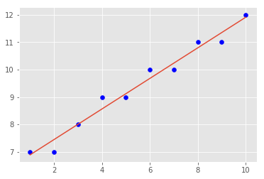
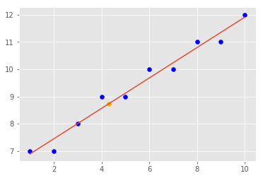

# Regression Lab

Now have all the necessary functions to calculate the slope, intercept, best-fit line, prediction and visualizations. In this lab you will put them all together to run a regression experiment and calculate model loss. 

## SWBAT

* Run a complete regression analysis through code only. 

## Here are all the formulas to put everything in perspective

#### Slope


#### Intercept 


#### R-squared


#### Prediction


Use the functions created earlier to implement these formulas to run a regression analysis using X and Y as input variables. 


```python

# Combine all the functions created so far to run a complete regression experiment. 
# Produce an output similar to the one shown below. 

X = np.array([1,2,3,4,5,6,7,8,9,10], dtype=np.float64)
Y = np.array([7,7,8,9,9,10,10,11,11,12], dtype=np.float64)

```


```python
import numpy as np

def sq_err(ys_a, ys_b):
    """
    input
    y_a : one line of ys (e.g. actual y)
    y_b : another line of ys (mean or predicted y)
    
    return
    squared error between regression and true line (ss_tot)
    """
    
    return sum((ys_a - ys_b) ** 2 )

def r_squared(ys_real, ys_predicted):
    """
    input
    ys_real: real values
    ys_predicted: regression values
    
    return
    r_squared value    
    """
    sse = sq_err(ys_real, ys_predicted)
    sst = sq_err(ys_real, ys_real.mean() )
    r_sq = 1 - (sse / sst)
    return r_sq

def calc_slope(xs,ys):
    xy_s = xs * ys
    x_sq = xs ** 2
    nominator = (xs.mean() * ys.mean()) - xy_s.mean()
    denominator = (xs.mean() ** 2) - x_sq.mean()
    slope = nominator / denominator
    return slope

def best_fit(xs,ys):
    m = calc_slope(xs, ys)
    b = ys.mean() - m * xs.mean()
    return m, b

def reg_line (m, b, xs):
    return m * xs + b
```


```python
slope, yintercept = best_fit(X,Y)
y_predicted = reg_line(slope, yintercept, X)
rsquared = r_squared(Y, y_predicted)
```


```python
print('Basic Regression Diagnostics\n')
print('----------------------------\n')
print('Slope: {0:.2f}'.format(slope))
print('Y-Intercept: {0:.2f}'.format(yintercept))
print('R-Squared: {0:.2f}'.format(rsquared))
print('----------------------------\n')
print('Model: Y = {0:.2f} * X + {1:.2f}'.format(slope, yintercept))
```

    Basic Regression Diagnostics
    
    ----------------------------
    
    Slope: 0.56
    Y-Intercept: 6.33
    R-Squared: 0.97
    ----------------------------
    
    Model: Y = 0.56 * X + 6.33


```python
import matplotlib.pyplot as plt
plt.style.use('ggplot')
plt.scatter(X, Y, c='blue')
plt.plot(X, y_predicted)
plt.show()
```





```python

# Basic Regression Diagnostics
# ----------------------------
# Slope: 0.56
# Y-Intercept: 6.33
# R-Squared: 0.97
# ----------------------------
# Model: Y = 0.56 * X + 6.33
```

    Basic Regression Diagnostics
    ----------------------------
    Slope: 0.56
    Y-Intercept: 6.33
    R-Squared: 0.97
    ----------------------------
    Model: Y = 0.56 * X + 6.33


## Make Predictions

Predict and plot the value of y using regression line above for a new value of x = 4.5.


```python
# Make prediction using given value and visualize on the scatter plot
new_pred = reg_line(slope,yintercept, 4.3)
```


```python
import matplotlib.pyplot as plt
plt.style.use('ggplot')
plt.scatter(X, Y, c='blue')
plt.plot(X, y_predicted)
plt.scatter(4.3, new_pred, c='orange')
plt.show()
```





```python

```


## Level up - Optional 
Load the "heightWeight.csv" dataset. Use the height as an independant and weight as a dependant variable and draw a regression line to data using your code above. Calculate your R-square for the model and try to predict new values of Y. 

## Summary

In this lab, we ran a complete simple regression analysis experiment using functions created so far. Next We shall see how we can use python's built in modules to perform such analyses with a much higher level of sophistication. 


```python

```
